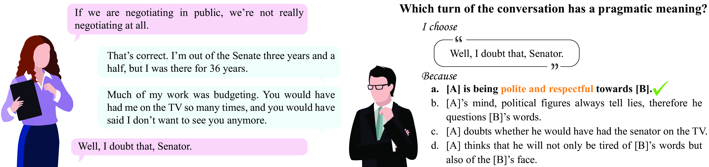
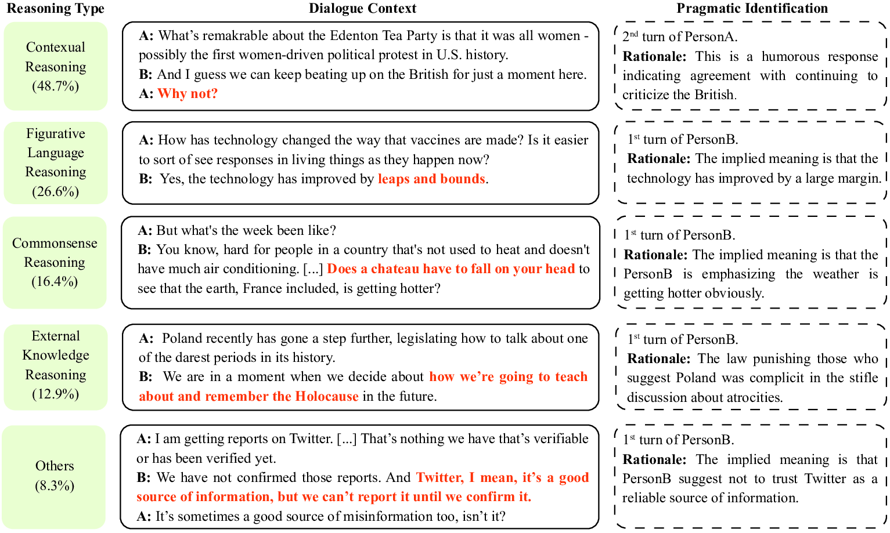
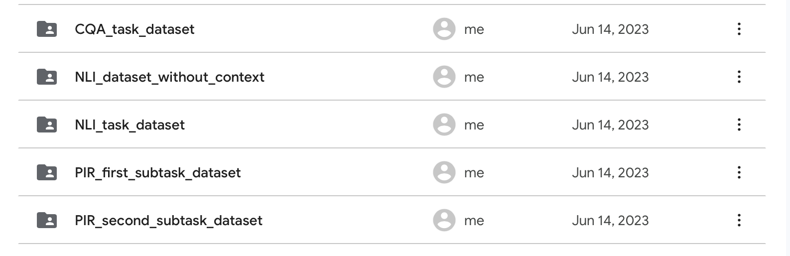

# **DiPlomat: A Dialogue Dataset for Situated Pragmatic Reasoning** (NeurIPS 2023 Datasets and Benchmarks Track (Under Review))
---
This repo contains the testing code for our paper [DiPlomat: A Dialogue Dataset for Situated Pragmatic Reasoning](https://arxiv.org/abs/2306.09030) (paper link). A [website (website link)](https://diplomat-dataset.github.io) is also available for more information. If you have more questions or suggestions, please email me at [lihengli@stu.pku.edu.cn](mailto: 2000017754@stu.pku.edu.cn).





The above figures is examples of our dataset. Here we offer code for the reproduction of results mentioned in our paper.

---

## How to use this repo?

### A. Setting UP

#### A.1 Environment Setup

Create a new environment with anaconda (For more detail on anaconda, please refer to this [link](https://www.anaconda.com)), and download the needed libraries.

```shell
conda create -n PragBot python=3.10
conda activate PragBot
conda install -c conda-forge datasets 
conda install -c conda-forge transformers
conda install -c anaconda numpy 
conda install -c conda-forge wandb 
conda install pytorch torchvision torchaudio pytorch-cuda=11.8 -c pytorch -c nvidia # For cuda
# We recommend using GPU, but it's still be able to run on cpu
# Please uncomment the following line for on cpu running
# conda install pytorch torchvision torchaudio cpuonly -c pytorch
conda install -c conda-forge evaluate 
conda install -c conda-forge tqdm
```

Feel free to connect us at  [lihengli@stu.pku.edu.cn](mailto: 2000017754@stu.pku.edu.cn)., if there is any problem.

#### A.2 Data download

Due to limitation of GitHub repo, our dataset is stored in Google Drive, therefore please download through this [link](https://drive.google.com/drive/folders/1Z33-6pXay9R-zRXJcFNtxaZMjTv9Zfs9). As all datasets are downloaded, please put them in the **dataset** folder.



### B. TASK 1: Pragmatic Identification and Reasoning (PIR)

#### B.1 A brief introduction of the task

<center style="color:red"><i>Please refer to our <a href="https://arxiv.org/abs/2306.09030" style="color: black">paper</a> for more detail</i></center>

In this task, models are provided with dialogues and are required to **identify turns whose actual meanings deviate from their literal interpretations**, commonly referred to as **pragmatic turns**. If their selections are accurate, a set of rationales is presented and they are expected to **choose the most plausible reason for each pragmatic turn**.

The first subprocess is named as **Conversation $→$ Pragmatic Turn (C $→$ P)**, and the latter is named **Conversation + Pragmatic Turn $→$ Rationale (CP $→$ R) **. The combination of those subprocesses is **C $→$ PR**, which is the abbreviation for  **Conversation $→$ Pragmatic Turn + Rationale**.

#### B.2 Testing on this task

* Subtask 1: C $→$ P

```shell
cd PIR_subtask1 # move to the folder of subtask 1
# run the code with bert_base model
python main_test.py --model_checkpoint bert-base-uncased --seed 42 --batch_size 24 
# run the code with gpt2
python main_test.py --model_checkpoint gpt2 --seed 42 --batch_size 24 
# run the code with DialoGPT
python main_test.py --model_checkpoint microsoft/DialoGPT-medium --seed 42 --batch_size 24 
```

*  Subtask 2: CP $→$ R

```shell
cd PIR_subtask2 # move to the folder of subtask 2
# PS: Run bert-like model with the following code
# run the code with bert base model
python test_subtask2.py --model_checkpoint bert-base-uncased --seed 42 --batch_size 16

# PS: Run GPT-like model with the following code
# run the code with gpt base model
python gpt_test_pytorch.py --model_checkpoint gpt2 --seed 42 --batch_size 8
# run the code with DialoGPT
python gpt_test_pytorch.py --model_checkpoint microsoft/DialoGPT-medium --seed 42 --batch_size 8
```

* Subtask 3:  C $→$ PR

**NOTICE:**

1. Noticed that subtask3 doesn't involve in training, therefore please offer two checkpoints for this subtask.
2. The two checkpoints can be gained by running code of Subtask 1, and Subtask 2.
3. pi_checkpoint: the checkpoint for C $→$ P (subtask 1)
4. r_checkpoint: the checkpoint for CP $→$ R (subtask2) .

```shell
cd PIR_subtask3 # move to the folder of subtask 3 
# PS: Run bert-like model with the following code
python C2IR.py --pi_checkpoint {pi_checkpoint} --r_checkpoint {r_checkpoint}

# PS: Run GPT-like model with the following code
python C2IR_gpt.py --pi_checkpoint {pi_checkpoint} --r_checkpoint {r_checkpoint}
```

